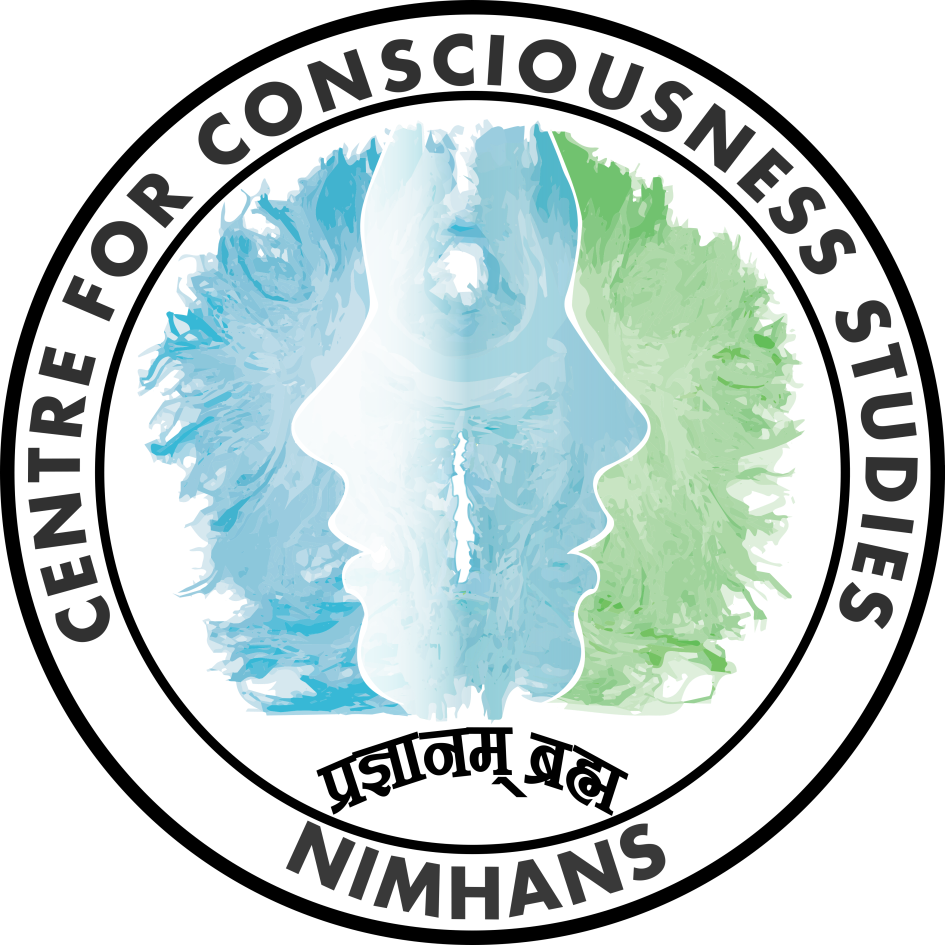
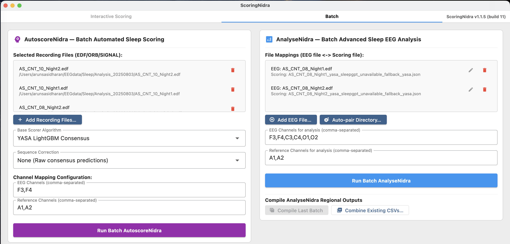
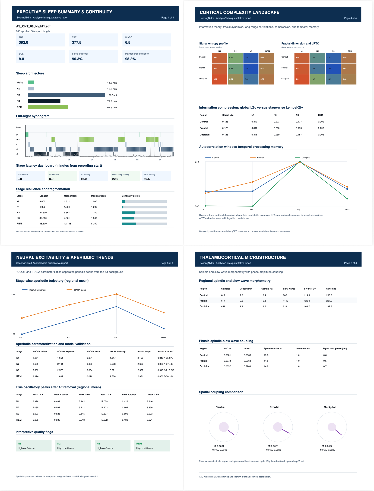

# CCS Sleep Studio - The High-Performance Sleep EEG Visualization, Annotation & Analysis Suite

<p align="center">
  
</p>

<p align="center">
  Developed by the <b>Team from Centre for Consciousness Studies (CCS)</b>,<br>
  Department of Neurophysiology,<br>
  <b>National Institute of Mental Health and Neurosciences (NIMHANS)</b>, Bangalore, India.
</p>

**Version:** 1.2.12

Welcome to **CCS Sleep Studio**, a high-performance, cross-platform desktop application designed to assist researchers and clinicians in sleep EEG visualization, event annotation, sleep scoring, automated staging, and advanced EEG analysis.

CCS Sleep Studio is comprised of the following key modules:
*   **ScoringNidra**: Interactive sleep scoring and event annotation module within the app.
*   **AutoscoreNidra**: Automated sleep scoring module with both interactive and batch modes.
*   **AnalyseNidra**: Automated sleep EEG analysis and reporting module operating in both interactive and batch modes.

Built from the ground up using **Flutter** for a lightweight, fluid UI, and **Rust** for native-speed signal processing, **CCS Sleep Studio** is inspired heavily from the Python-based [ScoringHero](https://github.com/SvennoNito/ScoringHero) repository. It operates without any complex Python or MATLAB runtime setup, bringing near-instant response times to massive sleep EEG files and advanced analysis.


---

## About

**CCS Sleep Studio** is a standalone desktop platform for sleep EEG review, manual staging, automated sleep scoring, and quantitative sleep neurophysiology. It combines a Flutter interface with native Rust signal-processing backends so full-night polysomnography files can be loaded, filtered, scored, compared, and analyzed without maintaining a separate Python or MATLAB environment.

The application is built for research and clinical neurophysiology workflows that need repeatable staging, transparent manual review, batch processing, AnalyseNidra quantitative reports, and exportable outputs across macOS, Windows, and Linux.

---

## 📥 Download Standalone Releases

We compile two distinct variants of **CCS Sleep Studio** automatically via GitHub Actions:
*   **CCS Sleep Studio (Full)**: Includes manual scoring (ScoringNidra), data loaders, detections, advanced sleep EEG analysis (AnalyseNidra) plus the packaged Python ML runtime to run automated staging models locally (AutoscoreNidra).
*   **CCS Sleep Studio Lite**: A lightweight version focusing exclusively on manual scoring, EEG visualization, data loaders, and advanced sleep EEG analysis (AnalyseNidra), with a significantly smaller download size (does not bundle Python runtimes of AutoscoreNidra).

[](https://github.com/arunsasidharan84/CCS-Sleep-Studio/releases/latest)
[](https://github.com/arunsasidharan84/CCS-Sleep-Studio/releases)

📦 **[Download Application Packages from GitHub Releases Page](https://github.com/arunsasidharan84/CCS-Sleep-Studio/releases)**

| Operating System | Variant | Package Type | Release Asset Name |
|------------------|---------|--------------|--------------------|
| **macOS** | **Full** | Universal ZIP | `CCSSleepStudio-macos.zip` |
| | **Lite** | Universal ZIP | `CCSSleepStudio-lite-macos.zip` |
| **Windows** | **Full** | x64 Installer EXE | `CCSSleepStudio-Installer.exe` |
| | **Lite** | x64 Installer EXE | `CCSSleepStudio-lite-Installer.exe` |
| **Linux (Debian/Ubuntu)** | **Full** | x64 DEB Installer | `CCSSleepStudio-linux-amd64.deb` |
| | **Lite** | x64 DEB Installer | `CCSSleepStudio-lite-linux-amd64.deb` |
| **Linux (RHEL/AlmaLinux)** | **Full** | x86_64 RPM Installer | `CCSSleepStudio-linux-x86_64.rpm` |
| | **Lite** | x86_64 RPM Installer | `CCSSleepStudio-lite-linux-x86_64.rpm` |

All binaries and installer packages are published directly under the [GitHub Releases Page](https://github.com/arunsasidharan84/CCS-Sleep-Studio/releases).

On Debian, Ubuntu, Linux Mint, and compatible distributions, open the downloaded `.deb` in the software installer or run:
```sh
sudo apt install ./CCSSleepStudio-linux-amd64.deb
```
The installer registers CCS Sleep Studio in the desktop application menu and adds the `ccs-sleep-studio` command.

On Red Hat Enterprise Linux 9, AlmaLinux 9, Rocky Linux 9, and compatible systems, install the RPM with:
```sh
sudo dnf install ./CCSSleepStudio-linux-x86_64.rpm
```
Each release is smoke-tested inside AlmaLinux 9 before publication.

### For macOS Users
Because the application is signed ad-hoc, you must clear the macOS Gatekeeper quarantine flag after extracting:
1.  Download & Extract the zip folder into your **Downloads** folder.
2.  Open **Terminal**.
3.  Copy, Paste & Run the following command:
     ```sh
     xattr -rd com.apple.quarantine ~/Downloads/CCS\ Sleep\ Studio.app
     ```
4.  Now you are ready to run the **CCS Sleep Studio.app**.
5.  Drag and drop the **CCS Sleep Studio.app** into the **Applications** folder so that you can open it like any other app in the future.

---

## Sample PSG Data

The repository includes a small demonstration dataset in [`SamplePSGData`](SamplePSGData/) for testing the viewer, manual scoring import, batch workflows, and AnalyseNidra report generation.

* `SamplePSGData/Data/` contains four EDF PSG recordings.
* `SamplePSGData/ManualScorings/` contains matching manual scoring EDF files with the same base filenames.
* `SamplePSGData/Template_config.json` provides a reusable configuration template for the sample recordings.

Load a recording from `SamplePSGData/Data/`, then import the corresponding file from `SamplePSGData/ManualScorings/` as the scoring/comparison file.

---

## ⚡ Speed & Architectural Enhancements

CCS Sleep Studio overcomes the main performance bottlenecks of standard Python-based visualization tools:

1.  **Hybrid Flutter + Rust FFI Pipeline**: Heavy mathematical operations (zero-phase Chebyshev/Butterworth filters, Welch periodograms, Morlet wavelets) are written in Rust, leveraging SIMD compiler optimizations and multi-threaded processing via `rayon`.
2.  **Isolate-Based Background Worker**: Computations run off the main thread in background Dart **Isolates**, leaving the main interface to render at a locked 60+ FPS.
3.  **Zero-Copy Memory Access**: Transfers between Dart and Rust utilize direct pointers and `.asTypedList` buffer access to avoid slow copy loops.
    *   *Benchmarks*: Night-wide spectrogram updates complete in just **19 ms**, and wavelet time-frequency updates finish in **113 ms**.
4.  **Self-Contained Executables**: Zero environment configuration required. Even the Full edition bundles its model runtimes inside a standalone package.

---

## AutoscoreNidra — Automated Sleep Scoring (Full App Only)

**AutoscoreNidra** is the automated sleep-scoring system within CCS Sleep Studio. It provides a consistent UI, dependency preflight, live epoch progress, and local execution for modern deep-learning and machine-learning staging models:

*   **Multi-Montage Consensus Scoring**: AutoscoreNidra independently scores every selected EEG channel and clinically valid reference combination. It then combines their epoch-wise probabilities into one consensus hypnogram, reducing dependence on any single channel or montage.
*   **Optional SleepGPT Sequence Refinement**: After the base consensus scoring, SleepGPT can apply a condition-agnostic sequence correction pass. It uses the temporal sleep-stage sequence to reduce implausible transitions without requiring a diagnosis-specific model.
*   **Single-Channel EEG Support**: AutoscoreNidra can score recordings containing only one usable EEG channel. When multiple channels or reference combinations are available, it automatically expands to the multi-montage consensus workflow.
*   **Clear Scoring Filenames**: Final hypnograms use the suffix `_scoring.json`, for example `recording_yasa_scoring.json` or `recording_yasa_sleepgpt_scoring.json`, so they are easy to distinguish from AnalyseNidra and diagnostic JSON files.
*   **9 Supported Staging Models**:
    1.  **YASA LightGBM Consensus**: Lightweight boosted tree stager.
    2.  **Offline U-Sleep Consensus**: Local convolutional neural network inference.
    3.  **Luna POPS**: Probabilistic Sleep Stager (`lunapi` adapter).
    4.  **Greifswald Sleep Stage Classifier (GSSC)**: Clinical model stager.
    5.  **TinySleepNet**: Pretrained PhysioEx model.
    6.  **SeqSleepNet**: Sequence-to-sequence model.
    7.  **SleepTransformer**: Attention-based transformer stager.
    8.  **Dreamento**: Feature-engineered YASA classifier.
    9.  **SleepEEGpy**: Standard MNE/YASA scorer.
*   **Batch AutoscoreNidra**: Queue multiple EDF/ORB/SIGNAL files for sequential background scoring with live status and epoch progress.
*   **Interactive Checklists**: Configure stager EEG, EOG, EMG, and Reference signals dynamically using checklist selectors instead of manual comma-separated text input fields.


## AnalyseNidra — Advanced Sleep EEG Analysis

**AnalyseNidra** is the advanced quantitative neurophysiology subsystem, written in native Rust. It performs fast, multithreaded analysis of sleep architecture, spectral power, phase-amplitude coupling (PAC), slow waves, spindles, aperiodic dynamics, nonlinear complexity, and regional statistics.

By leveraging Rust's compiler optimizations and parallel execution (via `rayon`), the entire analysis runs over 6x faster than standard Python pipelines.

### Features
* **Spectral Analysis**: Fast Welch periodogram computation with median averaging.
* **Aperiodic Fit**: Native Levenberg-Marquardt implementations of FOOOF (Fitting Oscillations & One-Over-F) and IRASA (Irregularly Resampled Auto-Spectral Analysis) to isolate true oscillatory peaks from the background aperiodic 1/f slope.
* **Spindle Detection**: Port of the YASA (Yet Another Spindle Algorithm) spindle detection method.
* **Slow-Wave Detection**: Port of YASA slow-wave detection, including `sw_all_density_calc` normalized as slow-wave count per total NREM minute.
* **Phase-Amplitude Coupling (PAC)**: TensorPAC-compatible modulation index calculation for Slow-Wave/Sigma coupling.
* **Regional Compilation**: Aggregates all spectral features and event detections across scalp channels.
* **Master-Sheet Compilation**: Combines regional CSV outputs from the latest batch or independently completed AnalyseNidra runs into one provenance-preserving CSV.
* **Publication-Grade Sleep Report**: Generates a five-page PDF covering sleep continuity, thalamocortical coupling, FOOOF/IRASA aperiodic trends, oscillatory peaks, entropy, fractal dynamics, Lempel-Ziv complexity, autocorrelation windows, and a plain-English interpretation guide. Configurable study, investigator, and subject metadata can be added from the Report tab in Configuration.

### Command-Line Usage & Parameters
For advanced CLI workflows, the `analyse-nidra` executable can be invoked directly from the command line:

```sh
analyse-nidra <recording.edf> <scoring.json> [core.json|-] [pac.json|-] [slow-waves.json|-] [spindles.json|-] [regional.csv|-] [options]
```

#### Positional Arguments:
1. `<recording.edf>`: **[Required]** Absolute path to the raw input sleep EEG recording (EDF format).
2. `<scoring.json>`: **[Required]** Path to the epoch-by-epoch sleep scoring JSON file.
3. `[core.json|-]`: Path to save the core spectral, temporal, and nonlinear features per stage/channel in JSON format. Use `-` to skip writing this file.
4. `[pac.json|-]`: Path to save Phase-Amplitude Coupling (PAC) matrices. Use `-` to skip.
5. `[slow-waves.json|-]`: Path to save detected slow wave events and summary statistics. Use `-` to skip.
6. `[spindles.json|-]`: Path to save detected spindle events and summary statistics. Use `-` to skip.
7. `[regional.csv|-]`: Path to compile and save the 253-column regional EEG metric CSV. Use `-` to skip.

#### Named Options:
- `--channels <names>`: Comma-separated list of EEG channels to include in the analysis (e.g., `--channels F3,F4,C3,C4,O1,O2`). Defaults to `F3,F4,C3,C4,O1,O2`.
- `--references <names>`: Comma-separated list of reference channels (e.g., `--references M1,M2` or `A1,A2`). Samples from reference channels are averaged and subtracted sample-wise. If not specified, defaults to `M1,M2`. Can be omitted or left blank to run without re-referencing.





---

## 🎨 New UI Features

We have enriched the UI with several flexibility and control improvements:
*   **Smooth Draggable Plot Borders**: Manually adjust the vertical boundaries between the Spectrogram, Hypnogram, and Periodogram panels in real time by dragging. Resizing is cumulative, smooth, locked to respect screen size limits, and is automatically saved to the recording's `.config.json` file.
*   **Consolidated Batch Tab**: Houses Batch AutoscoreNidra, Batch AnalyseNidra, and AnalyseNidra master-sheet compilation in one workspace. Redundant batch menu commands are intentionally omitted.
*   **Hypnogram Horizontal Zoom**: View the hypnogram step chart fully (Full Night) or zoom in on 100, 200, or 400 epoch windows centered around the active epoch. All mouse taps map correctly to coordinates within the zoomed viewport.
*   **Wavelet Spectre Toggle**: The complex Morlet wavelet panel is off by default to avoid unnecessary computation and vertical scrolling, and can be enabled when needed.
*   **Slow Wave Activity (SWA) Toggle**: Show or hide the SWA delta-power overlay on the hypnogram timeline, hiding its slider controls when inactive.
*   **EEG Guide Customization**: Modify the thickness and color of the horizontal reference guide lines in the EEG viewport.
*   **Centred Label Layout**: Stage labels on the Hypnogram panel are vertically centered on their corresponding colored bands.

---

## Features

### Multi-Channel EEG Signal Display
*   View multiple EEG channels simultaneously with configurable vertical spacing.
*   Adjust per-channel amplitude scaling and vertical offsets.
*   Predefined, high-contrast channel colors (Black, Blue, Green, Magenta, Orange, Cyan).
*   Add amplitude reference lines and 1-second grid overlays.
*   **Stack channels** on a shared baseline for direct overlay comparison.
*   **Robust z-standardization** (median/IQR normalization) for cross-channel comparison.
*   Configurable time axis units: Seconds, Minutes, or Hours.

### Sleep Stage Scoring
*   Score epochs (default 30s) as **Wake** (`W`), **N1** (`1`), **N2** (`2`), **N3** (`3`), **REM** (`R`), or **Inconclusive** (`I`).
*   Clear a score using the `Delete` key.
*   **Confidence Flagging**: Press `Q` (or the "Toggle uncertain" toolbar button) to flag an epoch as uncertain. Flagged epochs are visually marked on the hypnogram step timeline and saved with low-confidence metadata.
*   Automatic save prompts on close if epochs remain unscored.

### Compare Scoring
*   Import a second scoring file (**Compare → Import scoring for comparison**) to evaluate against the current scoring.
*   **Disagreement Bands**: Epochs with conflicting scores are highlighted directly in the hypnogram timeline with a transparent red background band.
*   **Premium Scoring Report Card**: Displays Cohen's Kappa score ($\kappa$) with strength labels, a dynamically color-shaded Confusion Matrix (green for agreement, red for disagreement), and per-stage Precision, Recall, and F1-Scores.


### Event Annotation
*   **13 event types**: Artefact (`A`) + 12 fully customizable event markers (`F1`–`F12`).
*   Draw event regions directly on the signal using click-and-drag selection boxes.
*   Real-time display of event duration (seconds) and amplitude while drawing.
*   Double-click on an existing event to remove it.
*   **Erase events in selection**: Draw selection boxes and press `Backspace` to delete all events inside the drawn region.

### File Formats & Loaders
*   **Orbit (.orb / .signal) File Loader**: Native binary and JSON-lines parser for Orbit recordings, complete with gap-filling, linear interpolation, and automatic calibration scaling.
*   **EDF+ Annotations Reader**: Parses TAL structures directly from annotations channels.
*   **Polyman CSV Interval Loader**: Imports sleep events and labels from Polyman text logs.
*   **YASA List Parser**: Retains epoch alignment by preserving empty lines as unscored elements.

### Signal Filtering
*   Apply high-pass, low-pass, and notch filters independently to each channel.
*   Zero-phase Chebyshev Type 2 filters.
*   Live magnitude response plot updates in real time within the configuration dialog.

---

## ⌨️ Keyboard Shortcuts

| Shortcut | Action |
|----------|--------|
| `W` | Score current epoch as **Wake** |
| `1` | Score current epoch as **N1** |
| `2` | Score current epoch as **N2** |
| `3` | Score current epoch as **N3** |
| `R` | Score current epoch as **REM** |
| `I` | Score current epoch as **Inconclusive** |
| `Delete` | Clear current epoch score |
| `Q` | Toggle low confidence (uncertainty) |
| `ArrowRight` | Go to the next epoch |
| `ArrowLeft` | Go to the previous epoch |
| `A` | Draw **Artefact** event |
| `F1`–`F12` | Draw **Event 1**–**Event 12** |
| `Backspace` | Erase events in drawn selection |
| `Z` | Zoom on selected EEG |
| `Ctrl+K` | Open K-Complex Detection (MT-KCD) |
| `Ctrl+Shift+S` | Open Spindle Detection (MT-Spindle) |
| `Ctrl+C` | Open Settings/Configuration Dialog |

---

## 🚀 Running & Building Locally

### Prerequisites
*   [Flutter SDK](https://docs.flutter.dev/get-started/install) (latest Stable)
*   [Rust Toolchain](https://www.rust-lang.org/tools/install) (cargo)
*   For Windows installer: [Inno Setup](https://jrsoftware.org/isinfo.php) (iscc compiler)

### 1. Build the Rust Backend
Compile the native library for your platform first:
```sh
cd bridge
cargo build --release
```

### 2. Run the App
Start the app in development mode:
```sh
cd frontend

# Run on macOS
flutter run -d macos

# Run on Windows
flutter run -d windows
```

### 3. Compile Production Release
To compile the release packages:
```sh
cd frontend

# macOS Release (.app)
flutter build macos --release

# Windows Release (.exe and Inno Setup Installer)
flutter build windows --release
iscc windows/installer.iss
```
