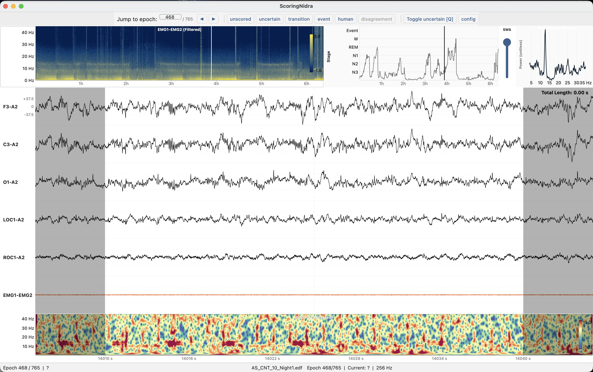
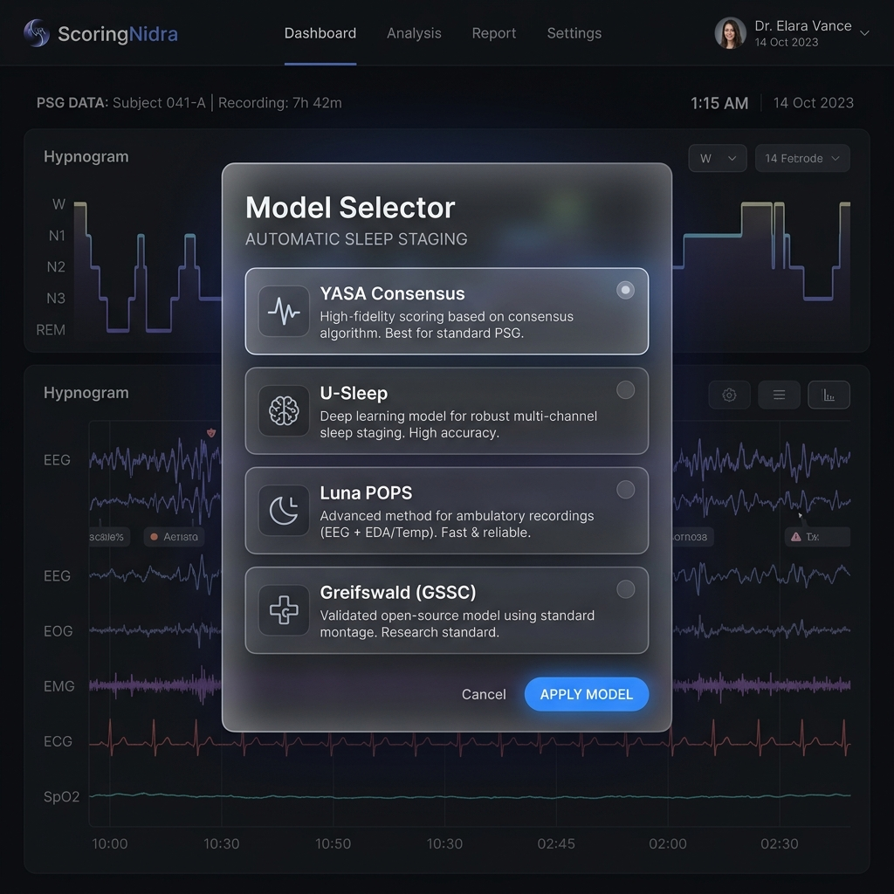
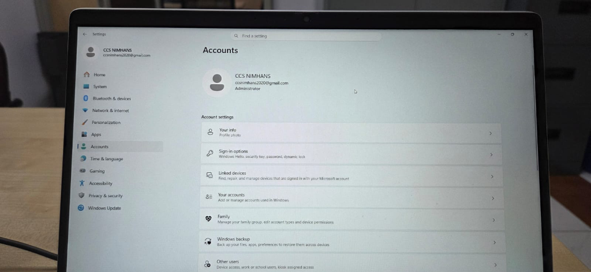
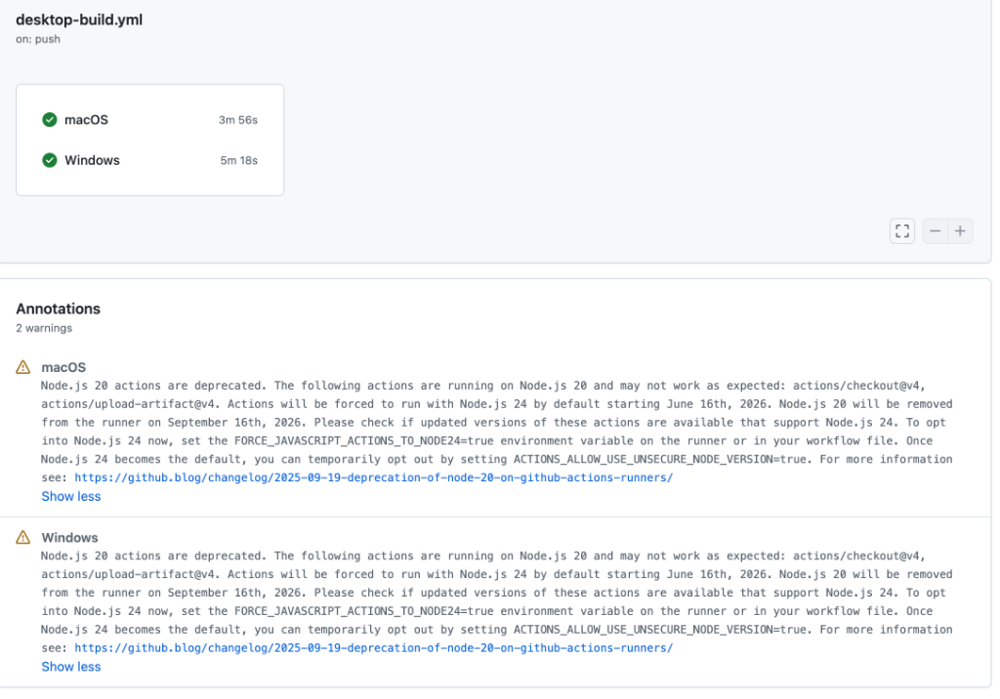

# ScoringNidra - The High-Performance Sleep EEG Visualization, Annotation & Scoring Software

Welcome to **ScoringNidra**, a high-performance, cross-platform desktop application designed to assist researchers and clinicians in sleep EEG visualization, event annotation, manual scoring, and automated sleep staging.

Rebuilt from the ground up using **Flutter** for a lightweight, fluid UI, and **Rust** for native-speed signal processing, **ScoringNidra** is a modernized, standalone recreation of the Python-based [ScoringHero](https://github.com/SvennoNito/ScoringHero) repository. It operates without any complex Python or MATLAB runtime setup, bringing near-instant response times to massive sleep EEG files.



---

## About

**ScoringNidra** is designed to overcome the performance lag and dependency hurdles of traditional sleep scoring applications. By combining the reactive rendering of Flutter with the computational muscle of Rust (via background Isolates and FFI), the application effortlessly handles full-night EEG recordings, real-time filtering, dynamic Welch periodograms, and Morlet wavelet decompositions.

---

## 📥 Download Standalone Releases

We compile two distinct variants of **ScoringNidra** automatically via GitHub Actions:
*   **ScoringNidra (Full)**: Includes manual scoring, loaders, detections, plus the packaged Python ML runtime to run automated staging models locally.
*   **ScoringNidra-lite**: A lightweight version focusing exclusively on manual scoring, EEG visualization, and loaders, with a significantly smaller download size (does not bundle Python runtimes).

| Operating System | Variant | Package Type | Download Link |
|------------------|---------|--------------|---------------|
| **macOS** | **Full** | Universal ZIP | [Download macOS Full](https://github.com/arunsasidharan84/ScoringNidra/releases/download/latest/ScoringNidra-macos.zip) |
| | **Lite** | Universal ZIP | [Download macOS Lite](https://github.com/arunsasidharan84/ScoringNidra/releases/download/latest/ScoringNidra-lite-macos.zip) |
| **Windows** | **Full** | x64 Installer EXE | [Download Windows Full](https://github.com/arunsasidharan84/ScoringNidra/releases/download/latest/ScoringNidra-Installer.exe) |
| | **Lite** | x64 Installer EXE | [Download Windows Lite](https://github.com/arunsasidharan84/ScoringNidra/releases/download/latest/ScoringNidra-lite-Installer.exe) |
| **Linux** | **Full** | x64 Tarball | [Download Linux Full](https://github.com/arunsasidharan84/ScoringNidra/releases/download/latest/ScoringNidra-linux.tar.gz) |
| | **Lite** | x64 Tarball | [Download Linux Lite](https://github.com/arunsasidharan84/ScoringNidra/releases/download/latest/ScoringNidra-lite-linux.tar.gz) |

### For macOS Users
Because the application is signed ad-hoc, you must clear the macOS Gatekeeper quarantine flag after extracting:
1.  Open **Terminal** and navigate to your extracted folder.
2.  Run the following command:
    ```sh
    xattr -rd com.apple.quarantine ScoringNidra.app
    ```
3.  Right-click `ScoringNidra.app` and choose **Open**.

---

## ⚡ Speed & Architectural Enhancements

ScoringNidra overcomes the main performance bottlenecks of standard Python-based visualization tools:

1.  **Hybrid Flutter + Rust FFI Pipeline**: Heavy mathematical operations (zero-phase Chebyshev/Butterworth filters, Welch periodograms, Morlet wavelets) are written in Rust, leveraging SIMD compiler optimizations and multi-threaded processing via `rayon`.
2.  **Isolate-Based Background Worker**: Computations run off the main thread in background Dart **Isolates**, leaving the main interface to render at a locked 60+ FPS.
3.  **Zero-Copy Memory Access**: Transfers between Dart and Rust utilize direct pointers and `.asTypedList` buffer access to avoid slow copy loops.
    *   *Benchmarks*: Night-wide spectrogram updates complete in just **19 ms**, and wavelet time-frequency updates finish in **113 ms**.
4.  **Self-Contained Executables**: Zero environment configuration required. Even the Full edition bundles its model runtimes inside a standalone package.

---

## 🤖 Automated Sleep Staging (Full App Only)

ScoringNidra incorporates a comprehensive suite of automatic sleep scorers powered by modern deep learning and machine learning models:

*   **9 Supported Staging Models**:
    1.  **YASA LightGBM Consensus**: Lightweight boosted tree stager.
    2.  **Offline U-Sleep Consensus**: Local convolutional neural network inference.
    3.  **Luna POPS**: Probabilistic Sleep Stager (`lunapi` adapter).
    4.  **Greifswald Sleep Stage Classifier (GSSC)**: Clinical model stager.
    5.  **TinySleepNet**: Pretrained PhysioEx model.
    6.  **SeqSleepNet**: Sequence-to-sequence model.
    7.  **SleepTransformer**: Attention-based transformer stager.
    8.  **Dreamento**: Feature-engineered YASA classifier.
    9.  **SleepEEGpy**: Standard MNE/YASA scorer.
*   **Sequence Correction (SleepGPT)**: An optional sequence correction pass applied to base stagers to correct unphysiological stage transitions.
*   **Batch Auto-scoring**: Queue multiple EDF files for sequential background auto-scoring. Includes live status monitoring and progress log output.
*   **Easy Setup**: Includes "Clear" selection buttons for instant channel configuration when matching signals for staging.



---

## 🎨 New UI Features

We have enriched the UI with several flexibility and control improvements:
*   **Adjustable Flex Ratios**: Customize the relative vertical grid sizes of the Spectrogram, Hypnogram, and Periodogram plot panels directly via the configuration dialog to suit different screen sizes and resolutions.
*   **Hypnogram Horizontal Zoom**: View the hypnogram step chart fully (Full Night) or zoom in on 100, 200, or 400 epoch windows centered around the active epoch. All mouse taps map correctly to coordinates within the zoomed viewport.
*   **Wavelet Spectre Toggle**: Easily toggle the complex Morlet wavelet spectrogram panel on or off to save vertical screen space.
*   **Slow Wave Activity (SWA) Toggle**: Show or hide the SWA delta-power overlay on the hypnogram timeline, hiding its slider controls when inactive.
*   **EEG Guide Customization**: Modify the thickness and color of the horizontal reference guide lines in the EEG viewport.
*   **Centred Label Layout**: Stage labels on the Hypnogram panel are vertically centered on their corresponding colored bands.

---

## Features

### Multi-Channel EEG Signal Display
*   View multiple EEG channels simultaneously with configurable vertical spacing.
*   Adjust per-channel amplitude scaling and vertical offsets.
*   Predefined, high-contrast channel colors (Black, Blue, Green, Magenta, Orange, Cyan).
*   Add amplitude reference lines and 1-second grid overlays.
*   **Stack channels** on a shared baseline for direct overlay comparison.
*   **Robust z-standardization** (median/IQR normalization) for cross-channel comparison.
*   Configurable time axis units: Seconds, Minutes, or Hours.

### Sleep Stage Scoring
*   Score epochs (default 30s) as **Wake** (`W`), **N1** (`1`), **N2** (`2`), **N3** (`3`), **REM** (`R`), or **Inconclusive** (`I`).
*   Clear a score using the `Delete` key.
*   **Confidence Flagging**: Press `Q` (or the "Toggle uncertain" toolbar button) to flag an epoch as uncertain. Flagged epochs are visually marked on the hypnogram step timeline and saved with low-confidence metadata.
*   Automatic save prompts on close if epochs remain unscored.

### Compare Scoring
*   Import a second scoring file (**Compare → Import scoring for comparison**) to evaluate against the current scoring.
*   **Disagreement Bands**: Epochs with conflicting scores are highlighted directly in the hypnogram timeline with a transparent red background band.
*   **Premium Scoring Report Card**: Displays Cohen's Kappa score ($\kappa$) with strength labels, a dynamically color-shaded Confusion Matrix (green for agreement, red for disagreement), and per-stage Precision, Recall, and F1-Scores.




### Event Annotation
*   **13 event types**: Artefact (`A`) + 12 fully customizable event markers (`F1`–`F12`).
*   Draw event regions directly on the signal using click-and-drag selection boxes.
*   Real-time display of event duration (seconds) and amplitude while drawing.
*   Double-click on an existing event to remove it.
*   **Erase events in selection**: Draw selection boxes and press `Backspace` to delete all events inside the drawn region.

### File Formats & Loaders
*   **EDF+ Annotations Reader**: Parses TAL structures directly from annotations channels.
*   **Polyman CSV Interval Loader**: Imports sleep events and labels from Polyman text logs.
*   **YASA List Parser**: Retains epoch alignment by preserving empty lines as unscored elements.

### Signal Filtering
*   Apply high-pass, low-pass, and notch filters independently to each channel.
*   Zero-phase Chebyshev Type 2 filters.
*   Live magnitude response plot updates in real time within the configuration dialog.

---

## ⌨️ Keyboard Shortcuts

| Shortcut | Action |
|----------|--------|
| `W` | Score current epoch as **Wake** |
| `1` | Score current epoch as **N1** |
| `2` | Score current epoch as **N2** |
| `3` | Score current epoch as **N3** |
| `R` | Score current epoch as **REM** |
| `I` | Score current epoch as **Inconclusive** |
| `Delete` | Clear current epoch score |
| `Q` | Toggle low confidence (uncertainty) |
| `ArrowRight` | Go to the next epoch |
| `ArrowLeft` | Go to the previous epoch |
| `A` | Draw **Artefact** event |
| `F1`–`F12` | Draw **Event 1**–**Event 12** |
| `Backspace` | Erase events in drawn selection |
| `Z` | Zoom on selected EEG |
| `Ctrl+K` | Open K-Complex Detection (MT-KCD) |
| `Ctrl+Shift+S` | Open Spindle Detection (MT-Spindle) |
| `Ctrl+C` | Open Settings/Configuration Dialog |

---

## 🚀 Running & Building Locally

### Prerequisites
*   [Flutter SDK](https://docs.flutter.dev/get-started/install) (latest Stable)
*   [Rust Toolchain](https://www.rust-lang.org/tools/install) (cargo)
*   For Windows installer: [Inno Setup](https://jrsoftware.org/isinfo.php) (iscc compiler)

### 1. Build the Rust Backend
Compile the native library for your platform first:
```sh
cd bridge
cargo build --release
```

### 2. Run the App
Start the app in development mode:
```sh
cd frontend

# Run on macOS
flutter run -d macos

# Run on Windows
flutter run -d windows
```

### 3. Compile Production Release
To compile the release packages:
```sh
cd frontend

# macOS Release (.app)
flutter build macos --release

# Windows Release (.exe and Inno Setup Installer)
flutter build windows --release
iscc windows/installer.iss
```
